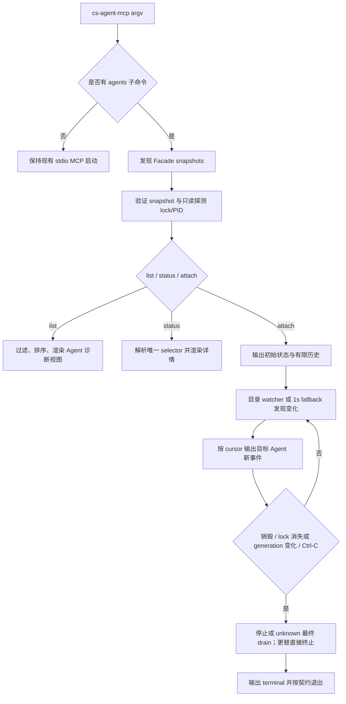

# Agent 运行状态诊断 CLI

## 0. 术语约定

| 术语           | 定义                                                                        | 防冲突结论                                                       |
| -------------- | --------------------------------------------------------------------------- | ---------------------------------------------------------------- |
| Facade 实例    | 一个 workspace 对应的 running / stopped / unknown cs-agent-mcp 状态集合     | 区别于底层 ACP Agent 进程；unknown 表示锁无法可靠探测            |
| Agent 诊断视图 | 从 Facade snapshot 投影的只读 Agent、Turn、权限和错误摘要                   | 不等同于 `cs_agent_status` 的实时 runtime 结果                   |
| 活跃 Agent     | 由 running Facade 实例持有，且状态不是 `destroyed` 的 root 或 managed Agent | `dormant`、`failed` 仍保留，便于排障                             |
| attach         | 先展示有限历史，再按 cursor 跟随目标 Agent 新事件的只读终端操作             | 不发送消息、不响应权限、不取消 Turn；JSON 使用结构化 JSONL       |
| Agent selector | 完整 Agent UUID 或在全部成功解析的 snapshot 中唯一的 UUID 前缀              | 与 list 过滤解耦；歧义或不可读 snapshot 下的前缀必须 fail-closed |

## 1. 决策与约束

### 需求摘要

为本机操作者提供 `cs-agent-mcp agents list|status|attach`：跨 workspace 列出活跃 Agent，查看
生命周期、当前 Turn、队列、待处理权限和最近错误，并只读跟随事件。成功标准是用户无需进入
MCP 调用方即可定位“哪个 Agent 在哪里、处于什么状态、最近发生了什么”。

明确不做：

- 不创建、销毁、取消 Agent，不发送消息，不响应权限。
- 不发布或复用 loopback HTTP 的身份 token，不绕过 Facade actor 权限执行控制操作。
- 不新增或迁移 `cs-agent-mcp.facade.v1` 持久化字段。
- 不承诺展示只存在于内存中的实时 runtime 使用量、模型列表或底层 Agent PID。
- 不把无参数 `cs-agent-mcp` 改成交互界面；它仍直接启动 stdio MCP，且 stdout 不增加提示。
- 不提供远程、多用户或跨主机诊断。

### 复杂度档位

走“对外发布的本地 CLI”默认档位，无偏离：外部输入与持久化数据按 L3 验证，模块化组织，公开
输出保持稳定并由集成测试覆盖。

### 关键决策

1. **数据源选持久化 snapshot，不连接 loopback HTTP。** snapshot 已包含 Agent、Turn、权限、错误
   和有序事件，写入采用临时文件原子替换；HTTP 地址和身份 token 没有发布给本地终端。拒绝把
   token 写入锁文件或新建控制 socket，因为这会扩大安全面并让诊断 CLI 获得不必要的控制能力。
2. **默认做全局发现，selector 始终在全集解析。** `agents list` 只枚举
   `~/.cs-agent-mcp/mcp/facades/` 中精确匹配 `^[0-9a-f]{24}\.json$` 的 snapshot，忽略原子写入的
   `.tmp`、`.lock`、`.candidate` 和其他目录。默认只列出 running 实例中的非 `destroyed` Agent；
   `--all` 才展示 stopped / unknown 实例和 destroyed Agent。status/attach 不复用这个过滤器，而在
   全部成功解析的 snapshot 中查找：完整 UUID 优先精确匹配；前缀若命中多个则列出候选及实例/
   Agent 状态；只要存在不可读 snapshot，前缀选择就拒绝宣称唯一并要求完整 UUID。
3. **提供三个命令和一个一致的结构化出口。** `list` 负责横向扫描，`status` 负责单 Agent 纵向
   详情，`attach` 负责时间线。`--json` 在 list/status 输出单个 JSON 文档，在 attach 输出逐行 JSON
   事件；默认文本输出面向终端扫描。
4. **attach 保持 Agent 级、只读和长连接语义。** 它输出初始状态、有限历史，再从该 snapshot 的
   cursor 继续；只显示目标 Agent 事件，按 cursor 严格递增。already-destroyed Agent 输出历史与
   `agent_destroyed` terminal 后返回 0；stopped / unknown 实例中的非 destroyed Agent 输出历史与
   `instance_stopped` / `instance_unknown` terminal 后返回 1；运行期间 Agent 销毁返回 0，Facade
   停止或 unknown 时先做一次最终 cursor drain，再以非零退出；lock generation 改变时直接输出
   `instance_replaced`，不重读可能已属于新 generation 的 snapshot。`Ctrl-C` 只停止观察，输出
   `interrupted` terminal 并返回 0。
5. **只暴露逐字段 allowlist 诊断模型。** CLI 不输出 snapshot 原文、identity token/hash、完整
   Message、Permission request、`sessionOptions` 原文或无关 Agent 数据；mapper 不得 spread 原始
   持久化对象或 `FacadeEvent.data`。attach 明确允许展示目标 Agent 的 output text delta 和有界工具
   摘要，这是显式 attach 的排障价值；thought stream 只保留“已省略”标记，不输出正文；tool call
   丢弃 `rawInput`、`rawOutput`、`content` 与 usage breakdown。所有 summary/text 设字符上限并标记
   截断。README 必须说明 attach 会展示目标 Agent 的输出和工具活动摘要。

### 方案深度 pre-pass

候选一是只做 `agents list` 的最小工具；候选二是完整交付 list/status/只读 attach。选择候选二：
该能力是长期维护的公开排障入口，状态详情和时间线正是定位卡住问题的核心价值；现有 snapshot
已经提供所需真实数据，不需要 fake、额外服务或投机性解析。没有采用交互控制版 attach，因为它
改变权限与副作用边界，不属于诊断能力。

### 基线、依赖与假设

- 基线：当前 `pnpm run check` 已通过 198 项测试；S0 是 implementation 的硬前置，必须先提交或
  隔离现有 `max-turns-exceeded` issue 改动，记录干净/可归因的 `git status` 和基线检查，再进入 S1。
- 非显然依赖：Facade snapshot 必须继续原子写入；进程锁 PID 是“实例运行中”的唯一实时证据；
  snapshot 事件目前只增不删。
- 假设：同一 OS 用户读取 `~/.cs-agent-mcp/` 即代表有权查看其全部本地 Agent；状态目录权限不会
  放宽给其他用户。
- 假设：UUID 前缀仅作为便利选择器，所有结构化输出始终返回完整 Agent ID。

### Top 3 风险与缓解

| 风险                                          | 缓解与证据                                                                                         |
| --------------------------------------------- | -------------------------------------------------------------------------------------------------- |
| 历史 snapshot 或 stale lock 被误报为活跃      | 独立验证 snapshot 与 lock/PID；live/stopped/unknown/corrupt 多实例测试；PID 复用列为 residual risk |
| attach 反复解析持续增长的 snapshot 造成忙轮询 | watcher 通知去抖 + 最小 250ms 重读间隔 + 1s stat/liveness fallback；长历史读次数与时延测试         |
| 诊断路径意外写状态或泄露内部身份数据          | Node 权限模型下不给诊断子进程 fs-write 权限做 live 跟随；事件类型 allowlist 与 poison-field 测试   |

已接受的残余风险：

- lock 只记录 PID/token/createdAt，`kill(pid, 0)` 无法排除崩溃后 PID 被无关进程复用；诊断路径因此可能
  暂时把 stale lock 标为 running。CLI 不清锁、不纠正状态，README 标注 liveness 是 best-effort。
- v1 snapshot 是每次原子替换的整体 JSON 且 events 不裁剪；attach 无法增量解析文件，只能通过去抖、
  重读下限和输出上限约束成本。极大 snapshot 仍是 O(file size)，后续若成为瓶颈需另行演进 schema。
- `fs.watch` 跨平台存在合并/丢通知差异；1s stat fallback 保证最终可见，但不承诺亚秒级事件延迟。
  watcher 是全局 facades 目录级，其他 workspace 的写入也会唤醒回调；目标 snapshot/lock 的 stat
  signature gate 会在 parse 前吸收无关唤醒。

### 证据、交付物与清洁度

- 证据：纯函数/文件夹 fixture 测试、真实子进程 CLI 测试、运行中 mock MCP 集成测试、Node
  `--permission --allow-fs-read=*` 且无 fs-write 权限的 live attach 测试、临时 npm 安装 smoke、
  diff review。
- 交付物：公开命令与 help、只读诊断模块、CLI 输出契约测试、README 故障排查说明、CHANGELOG、
  MCP 架构文档中的只读边界。
- 清洁度：不新增调试日志、临时 TODO/FIXME、注释掉代码或无用 import；默认 stdio 路径不得向
  stdout/stderr 增加诊断输出。

## 2. 名词与编排

### 2.1 名词层

#### 名词现状

- `src/mcp/facade/types.ts` 的 `Agent`、`Turn`、`Permission`、`FacadeEvent` 与
  `FacadeSnapshot` 是持久化状态真相；schema 为 `cs-agent-mcp.facade.v1`。
- `src/mcp/facade/store.ts` 能做 top-level snapshot 检查并原子写入，但 nested records 当前靠类型
  断言，读入口也只是 writable store 的内部细节；诊断路径不能把它误当完整 L3 校验。
- `src/mcp/transport/process-lock.ts` 的锁记录包含 PID 和实例 token，但公开接口只支持抢锁；读取与
  存活判断未形成只读诊断契约。
- `src/mcp-cli.ts` 只有无子命令 action，所有参数最终进入 stdio MCP 启动。

#### 名词变化

新增独立的诊断投影，不改变 FacadeSnapshot，也不把原始持久化对象暴露给 renderer：

```ts
type ObservedFacadeInstance = {
  instanceId: string;
  state: "running" | "stopped" | "unknown";
  pid?: number;
  rootCwd?: string;
  snapshotPath: string;
};

type AgentDiagnosticSummary = {
  instance: ObservedFacadeInstance;
  agentId: string;
  kind: "root" | "managed";
  parentAgentId?: string;
  agent: string;
  name?: string;
  cwd: string;
  mode: "persistent" | "oneshot";
  depth: number;
  state: AgentState;
  activeTurnId?: string;
  queueDepth: number;
  createdAt: string;
  updatedAt: string;
  maxTurns?: number;
  lastError?: { code: string; message: string; retryable?: boolean; runtimeCode?: string };
};

type AgentDiagnosticDetail = AgentDiagnosticSummary & {
  activeTurn?: DiagnosticTurn;
  pendingPermission?: {
    permissionId: string;
    state: PermissionState;
    inferredKind?: string;
    requestedAt: string;
    expiresAt: string;
  };
};

type DiagnosticTimelineItem =
  | { schema: "cs-agent-mcp.diagnostics.v1"; kind: "snapshot"; agent: AgentDiagnosticDetail }
  | { schema: "cs-agent-mcp.diagnostics.v1"; kind: "event"; event: DiagnosticEvent }
  | {
      schema: "cs-agent-mcp.diagnostics.v1";
      kind: "terminal";
      reason:
        | "agent_destroyed"
        | "instance_stopped"
        | "instance_unknown"
        | "instance_replaced"
        | "interrupted";
    };
```

`DiagnosticTurn` 只含 turnId/state/revision/timestamps/pendingPermissionId/stopReason 与裁剪后的
error，不含 input/result Message ID。`DiagnosticEvent` 固定含 cursor/type/timestamp/agentId/turnId/
summary/truncated 和下表允许的 detail；不允许 `data: unknown`。list/status JSON 顶层分别固定为
`{schema, agents, warnings}` 与 `{schema, agent, warnings}`。来源是现有 snapshot、进程锁和 root
Agent；`instanceId` 是 snapshot 文件标识，不是新的持久化 ID，`rootCwd` 只表示 root Agent 的默认
cwd，不承诺还原完整 MCP roots。

事件投影白名单：

| Facade event                                  | Diagnostic detail                                            | 明确丢弃                          |
| --------------------------------------------- | ------------------------------------------------------------ | --------------------------------- |
| `turn.text_delta` 且 `stream === "output"`    | `text, stream, tag`，text 有长度上限                         | snapshot 其他消息                 |
| `turn.text_delta` 的 thought/缺失/非法 stream | 合法标量 `stream, tag` 与 `omitted: true`                    | 所有正文                          |
| `turn.status`                                 | `text, tag, used, size` 的标量摘要                           | cost breakdown、availableCommands |
| `turn.tool_call`                              | `toolCallId, status, title, kind, locations` 与有界 summary  | `rawInput, rawOutput, content`    |
| `turn.failed/completed/cancelled`             | `stopReason` 与裁剪后的 `code/message/retryable/runtimeCode` | 任意 error details/cause          |
| Agent/permission/message/audit lifecycle      | 按事件类型列举的 ID、state、kind、outcome 等标量             | 未知字段和 request 原文           |

所有 event mapper 必须 exhaustive；仅已知 `stream === "output"` 可输出 text，缺失、thought、非法
或未来 stream 值一律 fail-closed 为 `omitted: true`。新增 Facade event type 若没有显式投影，构建
或测试失败，不能静默透传。

公开命令契约：

```text
cs-agent-mcp agents list [--all] [--json]
cs-agent-mcp agents status <agent-selector> [--json]
cs-agent-mcp agents attach <agent-selector> [--history <count>] [--json]
```

示例：

```text
$ cs-agent-mcp agents list
AGENT ID  TYPE    NAME      STATE               TURN      QUEUE  WORKSPACE
8e12a4c1  claude  reviewer  waiting_permission  11f0a20c  0      /repo

$ cs-agent-mcp agents status 8e12a4c1 --json
{"schema":"cs-agent-mcp.diagnostics.v1","agent":{"agentId":"8e12a4c1-1111-4222-8333-123456789abc","state":"waiting_permission","instance":{"state":"running"}},"warnings":[]}
```

错误契约：selector 不存在返回 1；前缀命中多个 Agent 返回 1，并列出完整候选 ID、Agent 状态和
实例状态；完整 UUID 可在其他 snapshot 损坏时精确匹配，但附带 warning；前缀只要遇到任一不可读
snapshot 就返回 1 并要求完整 UUID。单个损坏 snapshot 在 list 中产生 stderr warning 并继续；所有
候选均不可读或 status/attach 目标不可读时返回 1。Commander 用法错误返回既有非零语义。

##### Interface 设计检查

- Module：新增 `AgentDiagnostics` 深模块，隐藏状态目录发现、schema 校验、锁/PID 判定、selector
  解析、cursor 跟随和输出 view model 组装。
- Interface：caller 只知道 list/read/follow 和稳定诊断 DTO；follow 必须接收 AbortSignal，事件有序
  且不修改任何状态。renderer 不能接触 FacadeSnapshot、IdentityRecord 或原始 event data。
- Seam：AgentDiagnostics 内部提供“验证后只读 snapshot file”窄入口，对 CLI 会消费的 Agent/Turn/
  Permission/Event nested fields 做 L3 required-field/type 校验，允许未知兼容字段但不透传；ENOENT 与
  invalid 分开返回，不复用 writable facade store。process-lock 导出不清理文件的 probe，内部返回
  PID/token/createdAt 与 running/stopped/unknown；token 只供 generation 比较。CLI 与测试都穿过
  AgentDiagnostics，不直接解析 JSON。
- Depth / locality：删除该模块会把文件发现、兼容校验、锁判定和 selector 逻辑散回三个命令，模块
  有真实深度。
- Dependency strategy：公开 `AgentDiagnostics` 接口不暴露测试 hook；生产使用 Node 只读 fs API。
  内部 `SnapshotFollower` 构造时接收 `readSnapshot`、clock/scheduler 与 watch notification source，
  测试用 counting reader + fake clock 确定性断言 debounce/read 上界；真实子进程再用 Node permission
  model 证明生产 adapter 没有 fs-write 能力。
- Adapter：仅 follower 的 volatile I/O/time 边界有窄内部 adapter，理由是 atomic rename、debounce 与
  fallback 必须确定性测试；其余状态目录/selector/renderer 不抽象假 port。只读 snapshot/lock probe
  是现有 persistence/lock module 的窄导出，不创建 store、不抢锁、不清 stale lock。
- Test surface：多实例发现、selector、状态组装、只读不变量和 attach 顺序均通过同一公开接口验证。

### 2.2 编排层



#### 现状

当前控制流是单分支：Commander 解析 `--cwd` 后配置本地 Claude、加载配置并启动 stdio MCP。
Facade 启动后每次 mutation 原子替换 workspace snapshot；事件携带单调 cursor；同路径的 lock 文件
标识唯一持有进程。CLI 没有旁路读取能力。

#### 变化

- argv 在副作用前分流：无子命令继续原路径；`agents` 子命令不配置 Agent、不加载 ACP runtime、
  不启动 stdio/HTTP server。
- list/status 使用一次性只读快照；attach 监听 snapshot 所在目录而不是会被 atomic rename 替换的
  文件 inode，并以 1s stat/liveness heartbeat 兜底 watcher 丢事件。通知先去抖，重读间隔不得低于
  250ms；只有 stat signature 或 lock 状态变化才完整重读，读到后一次消费全部更大 cursor。
- attach 内部记住初始 lock token 作为 generation，但不渲染、不记录 token。lock 消失或 PID 不再
  存活时，最终读取当前 generation 的 snapshot 并排空剩余目标事件，再输出 terminal；token 改变时
  直接输出 `instance_replaced`，不重读或输出可能属于新 generation 的事件。
- 初始历史从目标 Agent 当前事件中取最后 `history` 条并按 cursor 升序输出；随后把初始 snapshot 的
  最大 cursor 作为 follow baseline，早于 baseline 且因 history 上限省略的事件不会补发。`history=0`
  只输出 snapshot item，从当前 cursor 开始等待新事件。
- 诊断视角是“同 OS 用户的全局视角”，不套用 MCP 委派子树的 actor 可见性；它的授权边界是本地
  状态目录文件权限，且能力严格只读。

流程级约束：

- **兼容性**：无参数、`--cwd`、`--version`、`--help` 既有语义不变；任何诊断文本不得污染 stdio。
- **顺序与并发**：snapshot 原子替换保证单次读取完整；attach 按 numeric cursor 去重并排序，目录
  watcher 合并通知时从最新完整 snapshot 补齐，fallback 处理丢通知，最终 drain 处理 shutdown 尾部。
- **错误语义**：历史/损坏实例不阻塞其他实例 list；明确目标的 status/attach 失败则非零并写
  stderr。`Ctrl-C` 为用户正常结束，返回 0。
- **终止语义**：Agent destroyed 后输出该事件与 terminal 并返回 0；Facade 停止或 unknown 时最终
  drain 后输出 terminal 并返回 1；新 generation 替换时不跨代 drain，直接输出 terminal 并返回 1；
  Agent 从 running 变 idle 不自动退出。
- **幂等与只读**：list/status/attach 可重复执行，不创建目录、snapshot、lock、token 或会话，不
  清理 stale lock。
- **可观测点**：文本行包含 timestamp/type/agent/turn/summary；JSONL 每行有 schema/kind，使用完整
  ID 和原始 cursor。summary/text 最多 2,000 Unicode code points，截断时 `truncated=true`。
- **性能边界**：v1 snapshot 是整体 JSON，无法在不改 schema 的前提下真正增量解析。实现只限制
  重读频率和输出历史（`--history` 为 0..1000，默认 20）；内部 follower 的 counting reader 与 fake
  clock/scheduler 必须让 10,000 事件 fixture 确定性证明无忙循环、每个 debounce 窗口最多一次 parse，
  不用 wall-clock 时延充当读次数证据。超大 snapshot 的 O(file size) 解析列为 residual risk。

### 2.3 挂载点清单

- 公开挂载：npm binary `cs-agent-mcp` 的 Commander 命令树新增 `agents list|status|attach`，保留默认
  action；`src/mcp-cli.ts` 只调用 AgentDiagnostics 的 list/resolve/attach 接口并负责渲染。
- 内部挂载：`src/mcp/diagnostics/index.ts` 独立承载 snapshot 发现/L3 校验、selector、DTO、事件投影和
  follower；`src/mcp/transport/process-lock.ts` 只新增无清理副作用的只读 probe。
- 验证与交付挂载：`package.json` 与 `tsconfig.test.json` 注册 diagnostics 测试；
  `scripts/package-smoke.mjs` 覆盖安装产物；README、CHANGELOG 与 `docs/MCP_ARCHITECTURE.md` 记录公开
  命令、输出披露和只读边界。

本 feature 不新增配置 key、MCP 工具、持久化 schema、网络 endpoint 或后台任务。

### 2.4 推进策略

- S0 基线隔离：先提交或隔离 `max-turns-exceeded` issue 改动，记录可归因的 git status 与
  `pnpm run check` 基线。退出信号：feature 实现 diff 不含既有 issue 文件改动。
- S1 CLI 编排骨架：建立默认 stdio 与 diagnostics 分支，三个命令可达空读模型。
  退出信号：无参数 stdio 回归通过，三个 help 路径均可执行；任何新增 `*.test.ts` 已显式注册进
  `package.json` 的硬编码 `scripts.test` 清单，测试输出能按名称/计数证明执行。
- S2 只读发现与视图组装：接通 nested snapshot 校验、实例 probe、全集 selector 和诊断 DTO。
  退出信号：多实例 live/stopped/unknown/corrupt fixture 的 list/status 结果确定，候选文件不误报。
- S3 list/status 输出：完成终端表格、详情、JSON 与错误契约。
  退出信号：正常、空结果、歧义、损坏数据的子进程 CLI 测试通过。
- S4 attach 时间线：完成历史 baseline、目录 watcher + fallback、cursor 增量、事件投影、最终 drain
  与信号处理。退出信号：运行中 mock Facade 的无漏读/无重复/stop-restart/Ctrl-C 测试通过，且诊断
  子进程在没有 fs-write 权限时仍能 live follow。
- S5 Harden 与交付：验证敏感字段 poison fixture、10,000 事件性能边界、文档、构建和安装产物。
  退出信号：全部 core 场景、完整检查和临时 npm 安装 smoke 通过；tarball smoke 实际调用
  `agents --help/list/status/attach`，同时保留无参数 MCP 13 工具与 mock Agent 生命周期验证。

### 2.5 结构健康度与微重构

#### 评估

- 文件级 — `src/mcp-cli.ts`：45 行，职责单一；只应增加子命令注册，不承载诊断计算。
- 文件级 — `src/mcp/facade/store.ts`：166 行，服务 writable facade store；最终不修改，诊断 L3 解析
  留在独立模块，避免把投影专用校验并入 writer。
- 文件级 — `src/mcp/transport/process-lock.ts`：131 行，锁生命周期聚合；增加不清理的只读 probe
  属于原职责。
- 文件级 — `src/mcp/transport/entrypoint.ts`：278 行且启动职责较多；诊断路径不应放入该文件。
- 文件级 — `src/mcp/facade/facade.ts`：2230 行，已明显偏胖；本 feature 不修改它，也不借机拆分。
- 目录级 — `src/mcp/` 当前 3 个同层文件、2 个子目录；新增 diagnostics 子目录不会形成摊平，且
  能集中发现、视图和渲染职责。
- compound 未发现目录/命名 convention。

##### 结论：不做微重构

新逻辑直接落独立 diagnostics 模块；现有 store 保持不变，lock 只扩展窄只读 probe。Facade 大文件
拆分属于行为等价重构，另开 `cs-refactor` 才处理，不作为本 feature 前置。

## 3. 验收契约

### 3.1 关键场景清单

1. 无参数启动 → 直接提供 stdio MCP，stdout/stderr 无新增人类提示，13 个 MCP 工具仍可用。
2. 发现目录同时有两个 `{24hex}.json`、`.tmp`、`.lock` 和 `.candidate` → 只解析两个 snapshot，正常
   并发文件不产生损坏 warning；nested consumed record 损坏则该 snapshot 不可读。
3. 两个 running Facade 各有 Agent → 默认 list 跨 workspace 列出所有非 destroyed Agent 并稳定
   排序；stopped/unknown/destroyed 默认排除，`--all` 展示并标注；空结果返回 0。
4. status 使用完整 ID 或唯一前缀 → 输出 allowlisted instance/Agent/Turn/permission/error。selector
   在全集解析：隐藏目标可达；隐藏候选参与歧义并被列出；有 unreadable snapshot 时 prefix fail-closed，
   完整 UUID 对 readable snapshot 仍可匹配并给 warning。
5. 一个 snapshot 损坏、另一个正常 → list warning 后继续；selector 不假定损坏文件中没有候选，
   所有 snapshot 都不可读时返回 1。
6. attach 到 running Agent → 先输出 snapshot item 和最后 20 条历史，再从初始最大 cursor 跟随；目录
   watcher 合并/丢失通知和 atomic rename 不漏读，其他 Agent 事件不出现且无重复。
7. attach 初始目标已 destroyed → 输出历史和 terminal 后返回 0；初始实例 stopped/unknown 且 Agent
   未 destroyed → 输出历史和 terminal 后返回 1；运行期间 idle 继续等待，destroyed 返回 0。
8. Facade shutdown / unknown → 先最终 drain release 前的末尾事件，再输出 terminal 并返回 1；lock
   generation 更替 → 不读取新 generation 事件，直接输出 `instance_replaced` 并返回 1；`Ctrl-C` 输出
   interrupted terminal 并返回 0，且不跨新实例继续。
9. `--json` → list/status 是带 schema 的单个 JSON 文档，attach 每行是 snapshot/event/terminal 之一；
   完整 ID/cursor 保留，thought 正文、identity、Message、Permission request、raw tool payload 和
   poison fields 均不出现；text delta 的 stream 缺失、非法或非 output 时正文同样 omitted。
10. list/status/stopped attach 前后文件集合、hash、mtime 与 lock 不变；live attach 子进程在 Node
    `--permission --allow-fs-read=*` 且没有 fs-write 权限时仍能跟随 writer 进程的新事件。
11. 10,000 历史事件 + burst update → counting reader + fake clock 确定性证明 history 上限、debounce
    parse 次数和 cursor 顺序符合性能契约，不出现忙循环。
12. npm tarball 临时安装 → package smoke 实际调用 `agents --help/list/status/attach`，并验证无参数 MCP
    的 13 工具、mock Agent send/wait/destroy 生命周期。

permission 子进程测试只允许过滤 Node 自身精确匹配的 permission experimental warning；其余 stderr
仍参与断言。测试必须同时证明 `readFile/fs.watch/process.kill(pid, 0)` 可用和任意 fs-write 得到
`ERR_ACCESS_DENIED`，不能仅依赖启动参数字符串。

明确不做的反向核对：诊断实现中不得调用 Facade mutation、runtime create/start、HTTP identity
签发或 lock acquire/remove；schema 常量与 13 个 MCP 工具定义不得变化。

### 3.2 Acceptance Coverage Matrix

| Scenario                                  | Covered By Step | Evidence Type                     | Command / Action                            | Core? |
| ----------------------------------------- | --------------- | --------------------------------- | ------------------------------------------- | ----- |
| 基线隔离                                  | S0              | git + command                     | `git status --short`、`pnpm run check`      | yes   |
| 新增测试注册并实际执行                    | S1 / S5         | test runner output                | `pnpm run test` 中核对文件/名称/计数        | yes   |
| 无参数 stdio 兼容                         | S1 / S5         | integration                       | `pnpm run test`                             | yes   |
| 精确发现、nested 校验与过滤               | S2 / S3         | test                              | `pnpm run test`                             | yes   |
| selector 全集、歧义与 corrupt fail-closed | S2 / S3         | integration                       | `pnpm run test`                             | yes   |
| attach 历史、watcher、cursor 与初始终态   | S4              | process integration               | `pnpm run test`                             | yes   |
| stop/restart 最终 drain                   | S4              | process integration               | `pnpm run test`                             | yes   |
| JSON event-type allowlist                 | S3 / S4 / S5    | poison fixture + diff review      | `pnpm run test`                             | yes   |
| live attach 零写入 capability             | S4 / S5         | OS permission process test        | `pnpm run test`                             | yes   |
| 长历史性能边界                            | S4 / S5         | counting-reader + fake-clock test | `pnpm run test`                             | no    |
| tarball 安装 smoke                        | S5              | command + manual                  | 临时安装 npm pack 产物并运行 agents CLI/MCP | yes   |

### 3.3 DoD Contract

| ID             | 要求                                                    | 证据                 | 阻塞级别 |
| -------------- | ------------------------------------------------------- | -------------------- | -------- |
| DOD-DESIGN-001 | design 与 checklist 通过独立 design review              | design review        | blocking |
| DOD-IMPL-001   | checklist steps 全 done，公开命令与只读不变量有实现证据 | checklist / evidence | blocking |
| DOD-REVIEW-001 | code review passed 且无 unresolved blocking/important   | review report        | blocking |
| DOD-QA-001     | QA 覆盖全部 core 场景、构建与 tarball smoke             | QA report            | blocking |
| DOD-ACCEPT-001 | acceptance 核对文档、requirement 状态与最终 diff        | acceptance report    | blocking |

Validation Commands:

| ID      | 命令                                 | 目的                                               | 核心性     | 失败处理     |
| ------- | ------------------------------------ | -------------------------------------------------- | ---------- | ------------ |
| CMD-001 | `pnpm run check`                     | 格式、文档、类型、lint、构建、全部测试与 pack 检查 | core       | fix-or-block |
| CMD-002 | `node dist/mcp-cli.js --help`        | 核对默认入口与公开命令树                           | supporting | fix-or-block |
| CMD-003 | `node dist/mcp-cli.js agents --help` | 核对诊断命令公开契约                               | core       | fix-or-block |

Required Artifacts: design review、code review、QA、acceptance、完整命令输出、临时 npm 安装 smoke
记录、最终 diff summary。

## 4. 与项目级架构文档的关系

- requirement `agent-runtime-diagnostics` 在 acceptance 通过后从 `draft` 升为 `current`。
- `docs/MCP_ARCHITECTURE.md` 需要补充“本地只读诊断路径”：snapshot/lock 是观察源，HTTP actor
  仍是控制边界，诊断 CLI 不持有 token。
- 这是跨 CLI、persistence、process-lock 的稳定结构选择，design 确认后建议用 `cs-domain` 记录一条
  ADR，说明为什么选择 snapshot observation 而不是发布 live HTTP diagnostics endpoint。
- 不新增领域实体；`AgentDiagnostic` 是投影视图，不进入长期领域术语表。
