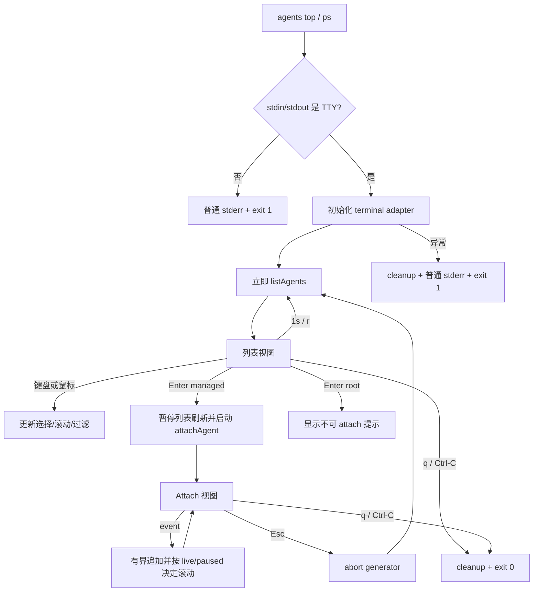

# Agent 实时监控 TUI 设计

## 0. 术语约定

| 术语        | 定义                                                                 | 防冲突结论                     |
| ----------- | -------------------------------------------------------------------- | ------------------------------ |
| Agent Top   | `cs-agent-mcp agents top` 启动的全屏只读 TUI；`agents ps` 是等价别名 | 不替代现有一次性 `agents list` |
| 列表视图    | 实时展示本机可见 Agent、状态、runtime、队列和 workspace 的主视图     | 数据来自现有 diagnostics DTO   |
| Attach 视图 | 在 TUI 内消费目标 managed Agent 的 `attachAgent()` 时间线            | 不接管会话、不发送消息         |
| root 身份   | Facade 为 MCP 调用者创建的控制身份，不承载 managed runtime           | 可展示但不可进入 Attach 视图   |
| live follow | Attach 视图停留在末尾并随新事件自动滚动                              | 用户向上滚动后进入 paused 状态 |

## 1. 决策与约束

### 需求摘要

本地操作者执行 `cs-agent-mcp agents top` 或 `cs-agent-mcp agents ps` 后进入全屏实时界面，
通过方向键、`j/k`、PageUp/PageDown、鼠标点击和滚轮选择 Agent；对 managed Agent 按 Enter
进入同一 TUI 内的 Attach 视图，按 Esc 返回原列表和原选择。界面必须在刷新、resize、退出和
异常时保持终端可恢复。

成功标准：

- 列表每秒刷新且不会因排序或数据变化把选择跳到另一个 Agent。
- 键盘和鼠标均可完成选择、滚动、进入 Attach、返回和退出。
- Attach 视图按 cursor 展示有限历史和新事件；用户滚离末尾时不抢滚动位置。
- root 明确标识且 Enter 不启动 attach；非 TTY 不输出控制序列并给出替代命令。
- 保持现有 diagnostics JSON、Facade schema、13 个 MCP tools 和只读边界不变。

### 明确不做

- 不在 TUI 中创建、发送、取消、销毁 Agent，也不响应 Permission。
- 不读取宿主 Codex/Claude 客户端自身的对话或 thought stream。
- 不修改 `cs-agent-mcp` 无参数启动 stdio MCP 的行为。
- 不新增远程监控、网络服务、持久化索引或新的 snapshot schema。
- 第一版不支持双击进入、拖拽、主题配置、列配置和插件化 widget。

### 复杂度档位

本地交互式 CLI 默认档位；偏离点是“持续状态 + 全屏鼠标输入”，因此必须有显式状态机、终端
资源清理和真实终端手工证据。数据规模沿用 Facade 现有限额，不设计虚拟化或高频流式数据库。

### 关键决策

1. **`top` 为主命令，`ps` 为别名。** `top` 符合持续交互语义，同时满足用户输入 `agents ps`
   进入界面的期望；现有 `agents list` 保持一次性、可管道化输出。
2. **Enter 在同一进程切换 Attach 视图。** 不退出 TUI 再启动文本 attach；Esc 中止当前
   generator，等待 pump 收束后立即刷新并返回列表，保留按 Agent ID 记录的选择。
3. **使用 `terminal-kit` 3.x 作为终端适配层。** 它是活跃的 MIT 纯 JavaScript 依赖，提供
   键盘、鼠标、resize 和全屏能力。Ink 缺少一等鼠标支持；neo-blessed 长期不活跃；OpenTUI
   引入平台原生包。`terminal-kit` 只存在于可替换 adapter 内，类型兼容和 tarball 安装在第一步
   先验证。
4. **状态机与终端渲染分离。** TUI 对外只暴露一个运行入口；状态更新、选择保持、滚动和
   attach 生命周期可用 fake terminal/data source 确定性测试，adapter 只负责终端协议。
5. **列表用 1 秒无重叠刷新，Attach 复用现有事件流。** 新刷新开始时若上一次尚未完成则合并为
   一次后续刷新，避免并发全量解析 snapshot；Attach 模式暂停列表轮询。
6. **内存有界。** Attach 初始读取最近 100 个事件，视图最多保留 2,000 个 timeline item；淘汰
   最旧项时保持当前 viewport 语义并显示已裁剪标记。
7. **所有 DTO 文本在 renderer 边界二次净化。** allowlist 不是终端安全边界；name、cwd、warning
   和 event summary 在测量、截断、绘制前剥离 CSI、OSC、DCS、C0/C1 与双向覆盖控制符，
   换行/tab 归一为空格，最终使用 no-format API 输出。不能只依赖 terminal-kit 的 ANSI helper。
8. **terminal-kit 延迟加载。** 默认 stdio MCP 与 list/status/attach 不加载 TUI CJS 依赖；仅 top/ps
   action 动态进入 TUI 模块，每个进程最多创建一个 production adapter。

### Top 3 风险与缓解

| 风险                                                 | 缓解                                                                                             |
| ---------------------------------------------------- | ------------------------------------------------------------------------------------------------ |
| 异常或信号后终端停留在 raw/alternate-screen 状态     | 所有入口统一 `try/finally` 清理；定向测试覆盖 q、Ctrl-C、初始化失败和 attach abort               |
| 鼠标库、类型声明或 CJS 打包与当前 ESM/tarball 不兼容 | 第一 checklist step 先完成依赖、构建、临时安装和最小终端 shell 证据，失败则回到选型而非继续堆 UI |
| 实时刷新导致选择跳动、重复读取或 attach 资源泄漏     | selection 以 Agent ID 锚定；刷新串行合并；每次模式切换持有并关闭唯一 AbortController             |

### 非显然依赖与关键假设

- 假设终端支持 ANSI alternate screen；不支持时由非 TTY/初始化检查明确失败，不回退到乱码输出。
- 假设 `AgentDiagnostics.listAgents()` 和 `attachAgent()` 继续维持只读、allowlist、generation 隔离契约。
- `terminal-kit` 与 `@types/terminal-kit` 的主版本可能不同；实现必须通过 typecheck 和真实 API
  spike 验证，不允许用宽泛 `any` 掩盖不兼容。
- 鼠标是增强输入；键盘路径始终完整，鼠标协议不可用时仍能操作全部核心流程。

### 必跑验证与交付物

- 必跑：`pnpm run check`、最终 tarball 临时安装 smoke、`pnpm run test:tui-e2e` 真实 PTY 键盘、
  SGR 鼠标、resize 与终端恢复验收。
- 交付：新命令及别名、独立 TUI 模块、依赖声明、单元/集成/CLI 测试、README/架构文档/
  CHANGELOG、review/QA/acceptance/evidence 产物。
- 清洁度：不得留下调试日志、临时 TODO/FIXME、注释掉代码、无用 import 或未恢复的终端监听器。

## 2. 名词与编排

### 2.1 名词层

#### 现状

- `src/mcp/diagnostics/index.ts` 的 `AgentDiagnostics` 提供 `listAgents()`、`resolveAgent()` 和可取消的
  `attachAgent()`；DTO 已区分 `root|managed`，Attach item 已限定为 snapshot/event/terminal。
- `src/mcp-cli.ts` 的 `createAgentsCommand()` 挂载 list/status/attach，文本 renderer 直接写 stdout。
- 当前没有全屏终端状态、输入事件、viewport 或 TUI 生命周期抽象。

#### 变化

新增一个 diagnostics TUI 深模块，对 CLI 暴露单一运行契约：

```ts
runAgentsTop({ diagnostics, signal, input, output, errorOutput, includeAll }): Promise<number>
// 来源：现有 AgentDiagnostics 与 mcp-cli Commander action
// 非 TTY/初始化失败 -> 返回 1 并写一条普通 stderr；正常 q/Ctrl-C -> 返回 0
```

模块内部拥有以下稳定概念：

- `TopMode`：`list` 或 `{ attach: agentId }`。
- `TopState`：Agent 列表、staleAgentIds、warnings、selectedAgentId、committed/draft filter、
  navigation/filter-editing 子状态、includeAll、viewport、session epoch、最后刷新时间和状态消息。
- `AttachState`：timeline items、live/paused、scroll offset、未读计数和可选 terminal reason。
- `TerminalEvent`：规范化的 key、mouse click/wheel 和 resize；业务状态机不解析 escape sequence。
- `TerminalAdapter`：封装 terminal-kit 的 alternate screen、raw input、绘制与 cleanup。
- `sanitizeTerminalText()`：renderer 的唯一文本入口，消除终端控制序列并保留可测量的显示文本。

接口示例：

```text
TTY + agents top -> 进入列表视图，q -> cleanup 后 exit 0
pipe + agents top -> stderr 提示使用 agents list/attach，exit 1，stdout 无 ANSI
选中 managed + Enter -> attach 视图；Esc -> abort attach，返回列表并立即刷新
选中 root + Enter -> 保持列表，底部显示 root 不含 managed runtime 输出
```

#### Interface 设计检查

- Module depth：一个运行入口隐藏终端库、状态机、刷新、鼠标和 cleanup，caller 不承担 TUI 复杂度。
- Locality：Agent 数据语义仍归 diagnostics；终端交互局限在 diagnostics TUI 子模块。
- Seam：`TerminalAdapter` 是真实外部依赖和确定性测试 seam；不为每个 widget 建 pass-through interface。
- Dependency：TUI 依赖 diagnostics DTO，diagnostics 核心不反向依赖 terminal-kit。

### 2.2 编排层



#### 现状

list/status 是一次读取后退出；attach 是线性 AsyncGenerator 消费，直到 terminal 或 SIGINT。CLI 不保存
选择、viewport 或模式，diagnostics 层已处理 snapshot 损坏 warning、selector、cursor、watcher、
generation 和最终 drain。

#### 变化

- 列表模式立即加载并每秒刷新。刷新只保留最新成功快照；暂时失败时保留旧数据并展示 warning，
  后续刷新可恢复。单 snapshot warning 时按 instanceId 保留该实例上一成功 rows 并标 stale，其他
  实例正常更新；全局读取失败保留整批旧数据。刷新不重入。
- 排序优先级为 waiting_permission、failed、running、creating、idle、dormant、destroying、destroyed，
  再按 workspace/name/Agent ID 稳定排序；selection 由 ID 保持，目标消失时选择邻近行。
- `--all` 只决定进入 TUI 时 includeAll 的初始值；之后可用 `a` 切换范围。`/` 从 committed filter
  复制 draft 并进入 filter-editing；编辑时字符（含
  q/a/r）只进入 draft，Backspace/Ctrl-U 编辑，Enter 提交，Esc 丢弃。`r` 立即刷新；方向键、
  j/k、Home/End、PageUp/PageDown 与鼠标滚轮控制 viewport，单击只选择、不隐式 attach。
- Enter 仅对 managed Agent 生效。Attach 视图消费初始 snapshot、100 条历史和后续事件；终态只显示
  banner，不退出整个 TUI。Esc abort 并回列表，q/Ctrl-C 退出全部。
- live follow 在 viewport 位于末尾时自动滚动；用户向上滚动后 paused 并累计未读，End 恢复 live。
- resize 重新计算列和 viewport。小于 72x12 时只显示尺寸提示和退出帮助，不产生重叠内容。

#### 流程级约束

- **只读**：仅调用 AgentDiagnostics 读接口；不得引入 Facade mutation、lock 修改或新的 token。
- **顺序**：同一时刻最多一个 list read、一个活动 attach generator；模式切换先 abort 再启动下一模式。
- **异步所有权**：每次 list/attach pump 捕获 session epoch；模式、all 范围或 shutdown 改变后，旧
  epoch 的 deferred 结果必须丢弃。Esc 先使 epoch 失效、abort 并等待 pump 收束，再刷新列表。
- **资源**：cleanup 幂等且按停止业务任务、自有 listener/timer、`fullscreen(false)`、cursor、
  mouse/raw 的顺序执行。terminal-kit 内部 process/resize listener 不由应用移除，仅允许每进程一个 adapter。
- **错误**：非 TTY/初始化 fatal 返回 1；瞬时读取 warning 不退出；q/raw Ctrl-C/SIGINT 返回 0；
  SIGTERM 清理后返回 143。errorOutput 由 TUI 入口所有，退出 alternate screen 后才写 fatal stderr。
- **数据安全**：TUI 只渲染 diagnostics DTO，不读取或显示原 snapshot、thought、identity 或 raw payload。
  所有 DTO 字符串先经过终端净化；表格行不换行，timeline 仅在净化后截断或换行。
- **可观测**：header 显示 managed/running/idle/waiting/queued 计数和最近刷新时间；footer 显示当前模式
  可用命令；warning 和 terminal reason 在固定状态区显示。

### 2.3 挂载点清单

1. npm binary 的 `agents` Commander 子命令树：新增 `top`，注册 `ps` alias。
2. 运行时依赖：新增 terminal-kit 及其类型支持，供 TUI adapter 使用。
3. 用户文档：README 诊断 CLI 命令、交互键位、root/managed 和非 TTY 边界。
4. 发布与架构说明：CHANGELOG 和 MCP 架构文档补充只读 TUI 编排层。

### 2.4 推进策略

1. 终端壳与依赖可行性：跑通延迟加载、TTY guard、alternate screen、输入和幂等 cleanup，并通过构建与临时
   tarball 安装。退出信号：最小 shell 可进入/退出且终端恢复，依赖不破坏 ESM/package smoke。
2. 列表状态机：接入 AgentDiagnostics 刷新、stale merge、稳定排序/选择、过滤子状态、includeAll、键盘和鼠标。
   退出信号：fake terminal/data source 测试覆盖刷新和全部选择路径。
3. Attach 子视图：接入 epoch/pump 所有权、可取消 generator、有界历史、live/paused、terminal banner 和 Esc 返回。
   退出信号：事件顺序、abort 收束、root 禁用、2,000 上限和正文保真测试通过。
4. 终端韧性与 polish：控制序列净化、resize、小终端、空态、warning、长文本、信号和 fatal cleanup。
   退出信号：所有可见状态无重叠，异常路径恢复终端并返回约定退出码。
5. 包与文档闭环：CLI/E2E、临时全局安装、13 tools 回归、真实键鼠验收和文档同步。
   退出信号：验收矩阵证据齐全，`pnpm run check` 与 package smoke 通过。

### 2.5 结构健康度与微重构

#### 评估

- 文件级 — `src/mcp-cli.ts`：职责是入口/命令挂载与轻量文本渲染；直接加入全屏状态机会形成新的
  UI/输入/刷新职责，因此只允许增加薄 action 调用。
- 文件级 — `src/mcp/diagnostics/index.ts`：已承担 1,000+ 行只读发现、解析、投影和 attach 编排，
  不应继续加入终端渲染。
- 目录级 — `src/mcp/diagnostics/` 当前仅一个核心文件，不摊平；TUI 包含状态、controller、adapter
  和 renderer 多个内聚文件，适合新增 `tui/` 子目录。
- compound 未发现目录组织或 TUI 归属约定。

#### 结论：不做前置微重构

新逻辑从第一步就进入独立 TUI 子模块；现有文件只增加挂载或导出，不需要先移动既有行为。

## 3. 验收契约

### 3.1 关键场景清单

1. 在真实 TTY 执行 `agents top` 或 `agents ps` → 进入同一全屏列表，1 秒内展示 running 实例的
   非 destroyed Agent，并可用 q/Ctrl-C 干净退出。
2. 多个 Agent 持续改变状态与排序 → 每秒刷新但 selection 始终锚定原 Agent ID；目标消失后选择
   邻近可见行，不越界或崩溃。
3. 使用方向键/j/k/PageUp/PageDown/Home/End、鼠标点击和滚轮 → 都能移动选择/viewport；单击不
   attach，Enter 才进入。
4. 选中 managed Agent 按 Enter → 同一屏进入 Attach 视图，按 cursor 显示历史和新事件；Esc
   abort 后返回原列表，q 退出全部。
5. Attach 时向上滚动 → 自动 follow 暂停并显示未读数；按 End 回到底部并继续跟随。
6. 事件超过 2,000 条或文本很长 → 内存保持有界、出现裁剪标记，文本按终端宽度截断/换行且不
   覆盖相邻区域；真实正文不因 event type fallback 被改写。
7. 选中 root 按 Enter → 留在列表并解释 root 没有 managed runtime 输出，不启动 generator。
8. 切换 `a`、输入 `/` filter、清空结果、snapshot 暂时不可读 → 分别展示 all/过滤结果/空态/warning，
   单实例损坏保留 stale rows，后续成功刷新可恢复；filter 编辑中的 q/a/r 不触发全局命令。
9. 终端 resize 到小于 72x12 再恢复 → 小尺寸只显示明确提示，恢复后完整布局重新出现且选择保留。
10. stdout 或 stdin 非 TTY → stdout 不含 ANSI，stderr 建议使用 `agents list`/`agents attach`，exit 1。
11. attach generation 更替、instance stopped/unknown、agent destroyed → Attach 视图显示对应 terminal
    reason，不跨 generation、不自动退出整个 TUI。
12. 初始化失败、运行中异常、q、Ctrl-C → cleanup 最多执行一次，raw/mouse/cursor/alternate screen
    全部恢复，无 listener 或 timer 泄漏。
13. 从 npm tarball 临时全局安装 → `agents top --help`、`agents ps --help` 可达；无参数仍启动 stdio
    MCP，SDK 仍列出 13 tools 并完成现有 lifecycle/diagnostics smoke。
14. name/cwd/warning/event summary 含 CSI、OSC 52、DCS、换行、tab、NUL、C1、双向覆盖符和
    CJK/emoji → 控制序列不执行、不跨行、不破坏列宽；安全可见文本仍保留。
15. `test:tui-e2e` 在隔离 HOME 和真实 PTY 中从 tarball 启动 top/ps，发送键盘、SGR mouse、resize、
    Enter/Esc/q，进入 managed Attach，并断言 shell 后续仍为 cooked+echo，输出包含 mouse/cursor/
    alternate-screen 的关闭序列。

### 3.2 明确不做的反向核对

- TUI 代码不得引用 Facade mutation 方法或写文件 API。
- diagnostics JSON/JSONL schema 和既有 list/status/attach 输出契约不得因 TUI 增字段。
- 无参数入口不得打印 TUI 文本、ANSI 或交互提示。
- 所有不可信 DTO 文本不得绕过 `sanitizeTerminalText()` 进入 terminal adapter。
- 不出现宿主会话读取、远程端点、配置主题/列 schema 或双击处理代码。

### 3.3 Acceptance Coverage Matrix

| Scenario                           | Covered By Step | Evidence Type            | Command / Action                      | Core? |
| ---------------------------------- | --------------- | ------------------------ | ------------------------------------- | ----- |
| TTY 启动、两命令等价、干净退出     | S1/S5           | CLI integration + manual | 真实终端执行 top/ps/q/Ctrl-C          | yes   |
| 实时刷新与选择稳定                 | S2              | deterministic test       | fake clock + 多轮 Agent 状态变更      | yes   |
| 键盘与鼠标交互                     | S2/S5           | adapter test + manual    | 键位、点击、滚轮逐项操作              | yes   |
| 同屏 Attach、Esc 返回、live/paused | S3              | integration + manual     | managed Agent 产生连续事件            | yes   |
| root 禁用与说明                    | S3              | CLI/state test           | root 行 Enter                         | yes   |
| 有界内存与正文保真                 | S3              | unit test                | >2,000 events + poison/长文本 fixture | yes   |
| resize/空态/warning/fatal cleanup  | S4              | integration test         | resize/failure/signal 注入            | yes   |
| 非 TTY 不输出 ANSI                 | S4              | process test             | pipe stdout/stderr                    | yes   |
| ANSI/OSC/C0/C1 与宽字符净化        | S4              | poison fixture           | sanitizer + renderer tests            | yes   |
| generation 与 terminal reason      | S3/S4           | diagnostics integration  | replacement/stopped/destroyed fixture | yes   |
| tarball、13 tools、默认 stdio 不变 | S5              | package smoke            | 临时安装 + MCP SDK                    | yes   |
| PTY 键鼠/resize/Attach/终端恢复    | S5              | executable PTY E2E       | `pnpm run test:tui-e2e`               | yes   |
| 无 mutation/新 schema/远程能力     | S5              | diff review              | 反向依赖与公开契约核对                | no    |

### 3.4 DoD Contract

| ID             | 要求                                                     | 证据               | 阻塞级别 |
| -------------- | -------------------------------------------------------- | ------------------ | -------- |
| DOD-DESIGN-001 | design/checklist 通过独立 design review 并由用户批准     | design review      | blocking |
| DOD-IMPL-001   | checklist steps 全 done，状态机/adapter/package 证据落盘 | checklist/evidence | blocking |
| DOD-REVIEW-001 | code review passed，无 unresolved blocking/important     | review report      | blocking |
| DOD-QA-001     | 自动测试与真实 TTY 键鼠验收覆盖全部核心场景              | QA report          | blocking |
| DOD-ACCEPT-001 | acceptance 核对公开契约、文档和 requirement 回写         | acceptance report  | blocking |

Validation Commands:

| ID      | 命令                                                          | 目的                                     | 核心性     | 失败处理     |
| ------- | ------------------------------------------------------------- | ---------------------------------------- | ---------- | ------------ |
| CMD-001 | `NPM_CONFIG_CACHE=/tmp/cs-agent-mcp-npm-cache pnpm run check` | 全量静态检查、测试、构建与 pack dry-run  | core       | fix-or-block |
| CMD-002 | `git diff --check`                                            | diff 清洁度                              | supporting | fix-or-block |
| CMD-003 | `pnpm run test:tui-e2e`                                       | 真实 PTY 键鼠、resize、Attach 和终端恢复 | core       | fix-or-block |

Required Artifacts：design-review、实现 evidence pack、code review、QA、acceptance、真实 TTY
键盘/鼠标记录、tarball package smoke 输出。

## 4. 与项目级架构文档的关系

- requirement `agent-runtime-diagnostics` 在 acceptance 时补充“实时总览与同屏 attach”用户故事，并把
  本 feature 加入 `implemented_by`。
- `docs/MCP_ARCHITECTURE.md` 在 acceptance 时补充 TUI controller/terminal adapter 与只读
  AgentDiagnostics 的依赖方向，以及 TUI 不进入 Facade/MCP transport 的边界。
- terminal-kit 被 adapter 隔离、可替换且不改变跨模块公共协议，本轮不需要 ADR；若实现中必须让
  diagnostics 核心反向依赖 TUI 或引入平台原生 runtime，则视为范围变化并重新评审设计。
- acceptance 同步修正 `requirements/VISION.md` 中 diagnostics 的状态与本 requirement 的 current
  状态一致。
