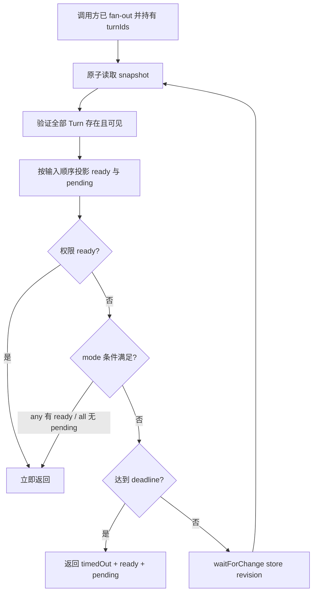

# Agent Wait Many

## 0. 术语约定

- **Wait Many**：一次观察多个 Turn 的只读 fan-in 操作，不创建、发送、取消或修改 Turn。
- **Ready Item**：已有回复、等待权限或已进入无回复终态的 Turn 结果。
- **Pending Turn**：尚未终结的 Turn；`waiting_permission` 仍是 pending，但同时产生一个 ready item，
  让调用方先处理权限。
- **Any / All**：Wait Many 的两种完成条件，不是两个额外 MCP 工具。Facade 提供 `waitAny` 和
  `waitAll` 便捷方法，公开 MCP 入口统一为 `cs_agent_wait_many`。

## 1. 决策与约束

### 需求摘要

调用方需要先向多个 Agent fan-out，再通过一个 MCP 请求等待任意或全部 Turn，而不是串行调用
`send + wait`。成功标准是多个 Turn 保持并发运行，单次等待能返回所有当前 ready 项、仍需跟踪的
Turn，以及明确的超时状态。

明确不做：

- 不新增同步 `cs_agent_run`，不把创建、发送和等待合并。
- 不实现调用方 Turn 已结束后的 Host 主动唤醒或 webhook。
- 不新增 `cs_agent_wait_any` / `cs_agent_wait_all` 两个公开工具。
- 不修改 Facade snapshot v1、Event、Message、Turn 或 Permission 持久化 schema。
- 不改变单 Turn 的 `cs_agent_wait_message` / `cs_agent_wait_turn` 行为。

复杂度走本地并发控制默认档位；对外 MCP schema 属于公开兼容契约，因此输入边界、错误语义和
返回顺序采用严格档位。

### 关键决策

1. 公开入口只有 `cs_agent_wait_many`，`mode` 为 `any | all`，默认 `any`。Facade 同时公开
   `waitMany`、`waitAny`、`waitAll`，三个方法共享一套计算与等待循环。
2. `turnIds` 接受 1-64 个 UUID；重复 ID 按首次出现顺序折叠。结果数组和 `pendingTurnIds` 均保持
   该顺序，避免并发完成导致输出漂移。Facade 在折叠前校验 raw 数组长度为 1-64；MCP schema
   另外校验 UUID、mode 和 waitMs。
3. 每轮从一个 Facade snapshot 原子读取并验证全部 Turn。任一 ID 不存在或不可见时整次请求使用
   既有 `TURN_NOT_FOUND` / `UNAUTHORIZED` 失败，不返回部分结果。
4. `any` 在存在 ready item 时立即返回，并返回该轮全部 ready item；调用方下一轮使用返回的
   `pendingTurnIds`，避免已完成项重复抢占。
5. `all` 等待 `pendingTurnIds` 为空；但任何权限请求都立即返回，防止等待权限的 Turn 与调用方
   互相阻塞。超时时返回已 ready 项和仍 pending 的 ID。它是可被权限/超时中断的 all：调用方须
   以 Turn ID 累计每轮 ready，后续 message/terminal 覆盖该 Turn 早先的 action_required，直到
   pending 为空。
6. `pendingTurnIds` 包含等待权限的 Turn，因为处理权限后该 Turn 仍需继续等待。
7. 等待复用 `FacadeStore.waitForChange(snapshot.revision)`，不为每个 Turn 建 timer、listener 或
   Promise race；无关更新可以唤醒重读，但不会改变结果。

### 风险与证据计划

- **权限死锁与累计遗漏**：`all` 若只等终态会永远卡住，若续传 pending 却不累计 ready 会遗漏
  早先完成项。通过两轮累计的权限短路单测和 MCP E2E 证明。
- **批量越权或部分泄漏**：先原子验证全部 Turn，再投影任何结果；用 sibling/unknown Turn 测试证明。
- **重复 ready 项造成调用方饥饿**：返回有序 `pendingTurnIds` 并在工具描述中要求续等 pending 集合；
  用两轮 any 测试证明每个结果可被消费。

非显然依赖是全局 store revision：无关 mutation 会造成一次额外重读，但不会轮询或丢失唤醒。

关键假设：owner 所说的 wait-any / wait-all “便捷方法”指 Facade 编程接口；MCP 客户端只增加一个
工具，通过 `mode` 选择语义。若需要三个公开工具，需在整体 review 时改设计并重新审查。

基线为 `pnpm run check` 255/255；实现完成必须运行 `pnpm run check`、实际 tarball SDK smoke，并
更新公开工具数量与文档。不得留下调试输出、临时 TODO/FIXME、注释掉代码或无用 import。

## 2. 名词与编排

### 2.1 名词层

**现状**：`WaitMessageResult` 表示单 Turn 的 reply、permission、terminal 或 timeout；
`MultiAgentFacade.waitMessage` 只能观察一个 Turn。MCP server 当前注册 13 个公开工具，推荐调用方通过
`events` 自己实现多 Turn fan-in。

**变化**：新增以下 Facade 导出类型与 MCP 结构化输出契约；`WaitManyReadyItem` 不包含 timed-out
分支，超时属于整次批量等待。

```ts
type WaitManyMode = "any" | "all";

type WaitManyReadyItem =
  | { status: "message"; message: Message; turn: Turn }
  | { status: "action_required"; turn: Turn; permission: Permission }
  | { status: "terminal_without_message"; turn: Turn };

type WaitManyResult = {
  mode: WaitManyMode;
  ready: WaitManyReadyItem[];
  pendingTurnIds: string[];
  timedOut: boolean;
  retryAfterMs?: number;
};

waitMany(input: { turnIds: string[]; mode?: WaitManyMode; waitMs?: number }, actor):
  Promise<WaitManyResult>;
waitAny(input: { turnIds: string[]; waitMs?: number }, actor): Promise<WaitManyResult>;
waitAll(input: { turnIds: string[]; waitMs?: number }, actor): Promise<WaitManyResult>;
```

来源：`src/mcp/facade/types.ts` 的 `WaitMessageResult` 与
`src/mcp/facade/facade.ts` 的 `waitMessage`。

正常示例：A 已回复、B 运行中，`mode=any` 返回 A 的 message，`pendingTurnIds=[B]`，
`timedOut=false`。错误示例：A 可见但 B 属于 sibling subtree，整次返回 `UNAUTHORIZED`，不返回 A。

累计示例：A 已回复、B 等权限、C 运行中，`all` 第一次返回 A 的 message 与 B 的
action_required，pending 为 `[B,C]`。调用方保存 A，响应 B 权限，再等待 `[B,C]`；最终以 B/C 的
message 覆盖累计 map，pending 为空时得到完整 A/B/C 集合。

**Interface 设计检查**：Facade 是 Turn 可见性与等待语义的现有 owner，新增接口归属自然；MCP server
只做 schema 校验与调用转发。批量投影逻辑集中在 Facade 子模块，调用方无需组合 Event cursor、Turn
和 Message，interface 提供了足够 leverage，不新增 adapter。

### 2.2 编排层



**现状**：单 Turn `waitMessage` 通过 `waitTurn` 逐 revision 等待；`events` 通过全局 store revision
实现无过滤轮询的 long-poll。拓扑是单目标等待循环。

**变化**：Wait Many 使用一个批量等待循环。每轮一次 snapshot read 完成校验和结果投影；
`waitAny` / `waitAll` 只固定 mode 后委托 `waitMany`。MCP 工具只注册一个入口，默认 any。Facade
负责调用私有可见性与终态 guard，并把已验证的 Turn、Message、Permission 和 terminal 布尔值交给
独立纯投影模块；新模块不复制可见性或终态规则。

流程级约束：

- `waitMs` 与现有工具一致，被 Facade limit 截断到 30 秒；0 表示只读即时快照。
- 权限请求优先于 any/all 完成条件返回；调用方处理后继续传入尚未终结的 ID。
- timeout 不取消 Turn；`retryAfterMs` 与单 Turn wait 一致，最大 1000ms。
- 结果不消费、不 ACK，重复相同输入会得到相同已完成项；调用方应续传 `pendingTurnIds`。
- all 被权限或 timeout 中断时，调用方必须按 `turn.turnId` 累计 ready；工具 description 和运行时
  instructions 明示该规则。
- Facade close、Broker restart 和 Workspace 共享行为沿用现有 store/owner 语义。

### 2.3 挂载点清单

- MCP tools/list：新增 `cs_agent_wait_many` 注册项。
- `cs_agent_capabilities.tools`：新增同名工具并保持确定顺序。
- MCP initialize instructions 及 `send`、单 Turn wait、新 wait-many 的 descriptions：多 Turn 明示
  “先全部 send，再 wait-many”；单 Turn 继续使用 wait-message。
- npm package smoke 的预期工具列表：从 13 项扩为 14 项；新增自包含
  `package:smoke:tarball` wrapper，负责 build:test、npm pack、临时 prefix 安装、binary/mock-agent
  环境注入、实际 wait-many 调用和临时文件清理，CI 复用同一入口。
- README 与 MCP architecture 的公开工具表和推荐并发流程：新增 wait-many 契约。

### 2.4 推进策略

1. 契约骨架：先增加类型、公开 schema 与 RED contract tests；退出信号是工具可发现且边界测试失败在
   未实现语义上。
2. 批量投影：实现原子校验、有序 ready/pending 和 timeout；退出信号是纯 Facade 场景全绿。
3. 并发等待：接通 store revision long-poll、权限短路和 any/all wrappers；退出信号是权限与 timeout
   中断后的两轮累计均完整，可计数 store 证明每轮只调用一次 waitForChange，且多 Turn 测试无串行
   等待或丢失完成项。
4. 发布契约：更新 capabilities、SDK E2E、package smoke 和用户文档；为 mock agent 增加文件 barrier
   指令，测试观察两个 Turn running 后创建释放文件；新增并由 CI 复用自包含 tarball wrapper。退出信号是
   14 tools tarball smoke、目标测试文件有实际通过用例且 `pnpm run check` 全绿。

### 2.5 结构健康度与微重构

#### 评估

- 文件级 `src/mcp/facade/facade.ts`：2316 行，但职责始终是 Facade 状态机；新增三个薄方法属于现有
  Turn 等待职责。批量投影计算不继续堆入该文件，落到同模块新文件。
- 文件级 `src/mcp/transport/server.ts`：545 行，按公开工具顺序集中注册；新增一个注册块是现有职责，
  未形成第三类概念。
- 目录级 `src/mcp/facade/`：当前 5 个同层文件，本次新增 1 个等待计算文件，未达到摊平阈值。
- compound 未发现目录或命名 convention 与本方案冲突。

#### 结论：不做

不搬迁既有代码。新计算逻辑按 Facade 模块归属放入独立文件，避免继续扩大状态机文件；薄 wrapper
保留在 `MultiAgentFacade`，让调用方获得明确 API。

## 3. 验收契约

### 3.1 关键场景

1. 三个已并发发送的 Turn 中两个同时完成、一个运行中，触发 any → 一次返回两个 message，pending
   只含运行中 Turn，顺序按输入。
2. 三个 Turn 逐步完成，触发 all → 全部终态前不返回；完成后 ready 含三项且 pending 为空。
3. all 等待期间任一 Turn 请求权限 → 立即返回 action_required，权限 Turn 仍在 pending。
4. any/all 到达 30 秒内的指定 waitMs → 返回 `timedOut=true`、当前 ready 和 pending，不取消 Turn。
5. 输入含重复 ID → 按首次出现折叠，结果不重复；Facade 对 raw 空数组和 raw 超过 64 项返回
   `INVALID_ARGUMENT`；MCP schema 额外拒绝非法 UUID、mode、waitMs、空数组和超过 64 项。
6. 任一 Turn 不存在或不可见 → 整批失败，不泄露其他 ready 内容。
7. `waitAny` 与 `waitAll` 分别等价于 `waitMany(mode=any|all)`。
8. MCP SDK 通过一个 root 向至少两个不同 Agent fan-out；在释放测试 barrier 前，两个 Turn 均被
   `get_turn` 观察为 running，再用 `cs_agent_wait_many` 收集完成结果，不以总耗时阈值代替并发断言。
9. MCP SDK 的 all 场景出现权限请求 → wait-many 返回 action_required；响应权限并续等后，累计结果
   包含此前完成和随后完成的全部 Turn，结构化输出字段保持一致。
10. 既有单 Turn wait、events、13 个旧工具 schema、Facade snapshot v1 与跨 Workspace权限保持不变。
11. 混合 message、terminal_without_message、action_required、running → ready/pending 保持输入顺序，
    `timedOut` 与 `retryAfterMs` 只在对应条件出现。
12. A 已完成、B 运行中时，waitAll timeout 返回 A 和 pending B；调用方保存 A 并续等 B，最终按
    Turn ID 累计出的 map 同时包含 A/B。

### 3.2 明确不做的反向核对

- tools/list 中不存在 `cs_agent_run`、`cs_agent_wait_any` 或 `cs_agent_wait_all`。
- diff 中不存在 webhook、Host notification、completion outbox 或 snapshot schema v2。
- 单 Turn wait 的既有输入与结构化输出测试无变化。

### 3.3 Acceptance Coverage Matrix

| Scenario                   | Covered By Step | Evidence Type           | Command / Action                             | Core? |
| -------------------------- | --------------- | ----------------------- | -------------------------------------------- | ----- |
| any 同时收集多个 ready     | S2/S3           | unit + integration      | 定向 Facade 测试                             | yes   |
| all 等待全部终态           | S3              | unit + integration      | 定向 Facade 测试                             | yes   |
| 权限短路与跨轮累计         | S3/S4           | unit + MCP SDK E2E      | permission 响应后续等测试                    | yes   |
| timeout 返回形状与后续累计 | S2/S3           | unit + integration      | 两轮 waitAll Facade 测试                     | yes   |
| 重复/空/上限               | S2/S4           | unit + MCP schema       | 定向 server 测试                             | yes   |
| 越权整批失败               | S2              | security regression     | sibling actor 测试                           | yes   |
| 单 store waiter            | S3              | instrumented store unit | 断言一轮 waitForChange 调用次数为 1          | yes   |
| 真实 fan-out/fan-in        | S4              | MCP SDK E2E             | 两个 Turn 同时 running 后释放 barrier        | yes   |
| 混合结果与字段条件         | S2/S3           | unit                    | message/terminal/permission/running 混合测试 | yes   |
| 14 tools tarball           | S4              | package smoke           | 临时安装 tarball                             | yes   |
| 旧契约不变                 | S4              | full regression         | `pnpm run check`                             | yes   |

### 3.4 DoD Contract

| ID             | 要求                                                      | 证据                                | 阻塞级别 |
| -------------- | --------------------------------------------------------- | ----------------------------------- | -------- |
| DOD-DESIGN-001 | design 与 checklist 通过独立 review 并获 owner 确认       | design review                       | blocking |
| DOD-IMPL-001   | steps 全部完成，RED/GREEN 证据落盘                        | checklist / implementation evidence | blocking |
| DOD-REVIEW-001 | 独立 code review 无 unresolved blocking/important         | review report                       | blocking |
| DOD-QA-001     | unit、真实 SDK 并发 E2E、全量 check 与 tarball smoke 通过 | QA report                           | blocking |
| DOD-ACCEPT-001 | 独立功能验收确认 fan-out/fan-in 与公开契约                | acceptance report                   | blocking |

Validation Commands:

| ID      | 命令                                                                                                  | 目的                                           | 核心性 | 失败处理     |
| ------- | ----------------------------------------------------------------------------------------------------- | ---------------------------------------------- | ------ | ------------ |
| CMD-001 | `pnpm run check`                                                                                      | 全量格式、类型、lint、build、test、pack        | core   | fix-or-block |
| CMD-002 | `pnpm run package:smoke:tarball`                                                                      | 实际 tarball 的 14 tools、wait-many 与生命周期 | core   | fix-or-block |
| CMD-003 | `pnpm run build:test && node --test dist-test/test/mcp-facade.test.js dist-test/test/mcp-e2e.test.js` | any/all/权限/越权/并发语义；记录非零通过数     | core   | fix-or-block |

Required Artifacts: design review、implementation evidence、independent code review、QA、independent
acceptance、tarball smoke 输出和 SDK E2E 结果。

## 4. 与项目级架构文档的关系

验收时把批量 fan-in、权限短路和有序 pending 语义提炼进 `docs/MCP_ARCHITECTURE.md`，更新 README
公开工具表和推荐流程。该能力是现有 Agent 编排的接口深化，不新增 requirement 或 ADR；若未来实现
Host 主动唤醒，再单独建立跨 Host delivery 设计。
