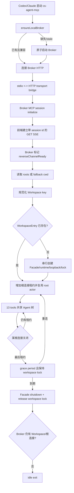

# Workspace 共享控制面设计

## 0. 术语约定

| 术语             | 定义                                                                                      | 防冲突结论                            |
| ---------------- | ----------------------------------------------------------------------------------------- | ------------------------------------- |
| Broker           | 本机按需启动的单一后台控制面入口，接收多个 stdio 前端连接并按 Workspace 路由              | 不作为安装时常驻系统服务              |
| stdio 前端       | Codex、Claude 等 MCP Host 启动的 `cs-agent-mcp` 进程，只负责 transport 桥接和 Broker 发现 | 不持有 Facade snapshot 写权限         |
| Workspace        | MCP roots 规范化、去重、排序后的目录集合；无 roots 能力时退化为 `--cwd`                   | 继续作为目录授权和状态隔离边界        |
| Workspace Facade | Broker 内某个 Workspace 唯一的状态所有者、runtime owner 和 loopback MCP owner             | 同一 Workspace 只有一个实例           |
| 共享根身份       | 同一 Workspace 中所有独立根客户端共同使用的 root execution 和 root Agent                  | 根客户端具有同等控制权限              |
| 根连接租约       | Broker 用于判断某个 stdio 前端仍存活的本地连接记录                                        | 与 managed Agent bearer identity 分离 |

## 1. 决策与约束

### 需求摘要

用户在同一个项目中分别运行 Codex 和 Claude 时，两边都应能同时调用 `cs-agent-mcp`，共享同一
Workspace 的 Agent 树，并创建、查看、等待、取消或销毁任一根客户端创建的 managed Agent。任一
控制台退出不得中断仍连接的其他控制台。`agents list|status|attach|top` 继续跨 Workspace 读取本机
全部 Facade snapshot，其中 `top` 明确是机器级总览。

成功标准：

- 同一 Workspace 的两个独立 stdio MCP 客户端可同时完成 13-tool lifecycle；并发启动路径明确断言
  不产生 `FACADE_ALREADY_RUNNING`。
- 两个客户端看到相同 Agent ID 和事件，并能交叉等待、取消、销毁对方创建的 Agent。
- 第一个客户端退出后，第二个客户端和进行中的 Turn 保持可用；最后一个根连接离开后才进入有界
  idle shutdown。
- 不同 Workspace 的 roots、状态、Agent 树、配置和目录授权保持隔离。
- Broker 崩溃或版本不兼容时 fail closed；下一次连接可恢复 stale descriptor/lock 和持久 session。
- 13 个工具名、输入输出 schema、Facade snapshot v1 和 diagnostics v1 不变。

### 明确不做

- 不允许多个进程并发写同一 Facade snapshot；不以缩小、取消或轮询 workspace lock 代替单写者。
- 不提供跨 OS 用户、跨机器或公网共享，不开放非 loopback 监听地址。
- 不为每个根客户端建立隔离 Agent 树；同一 Workspace 根客户端按用户确认共享同等控制权限。
- 不把 Broker 注册为 launchd/systemd 服务，不要求安装后常驻或新增公开 daemon 管理命令。
- 不让 `agents top` 只显示当前 Workspace，也不让只读诊断命令启动 Broker。
- 不在本 feature 中改变 runtime 支持矩阵、Agent 上限、Turn 队列或 permission 语义。

### 复杂度档位与方案深度

这是长期维护的本地并发控制面，错误会造成任务中断、权限越界或状态损坏，必须做真实 Broker、
真实 transport 桥接和真实多进程 E2E。仅在测试外部进程启动失败时使用替身；核心租约、路由和
Facade 所有权不得用 mock 代替。

比较过三个候选：

1. **取消 workspace lock，让多个 stdio 进程共享文件。** 拒绝；runtime owner、队列、permission
   waiter 和原子 snapshot 无法仅靠文件锁安全合并。
2. **第一个 stdio 进程兼任 owner，后来者连接它。** 拒绝；首客户端退出会触发 owner 迁移，roots
   解析发生在 MCP initialize 之后，handoff 与半初始化竞态过重。
3. **机器级按需 Broker，内部维护 Workspace Facade registry。** 采用；每个 stdio 前端有状态桥接，
   roots 解析在 Broker 的真实 MCP session 内完成，单写者和多客户端生命周期可同时成立。

### 关键决策

1. **Broker 是机器级入口，Facade 仍是 Workspace 级。** Broker 持有一个全局发现租约，并为每个
   活跃 Workspace 分别持有既有 snapshot lock；因此 diagnostics generation 和跨 Workspace 展示
   不需要合并成全局 snapshot。
2. **stdio 前端做有状态双向 transport 桥接。** 它使用 MCP SDK transport 转发 JSON-RPC，不重新
   声明或复制 13 个工具 schema；同时持有 HTTP session id、POST 响应和 standalone GET SSE 反向
   通道生命周期。Broker 侧的真实 `McpServer` 继续拥有 initialize instructions、roots 请求和 tool
   handler。该桥接不是字节直通，只有 Broker 确认 GET SSE 已建立后才能发送 server-initiated 请求。
3. **同一 Workspace 共享 root actor。** Broker 复用该 snapshot 中稳定的 root execution/root Agent；
   所有根连接获得同一 actor context，因而可见同一委派树并具有同等控制权限。
4. **Broker 由首个前端按需拉起。** descriptor 使用当前 OS 用户可读的 `0600` 文件，包含 protocol
   version、package version、pid、loopback endpoint 和随机 broker credential。独立 broker-lock
   串行化 idle-exit 与新启动；ready descriptor 复用 `open(wx)+link` 原子发布模式，loser 等待 winner
   发布。credential 不进入 argv、日志或 Facade snapshot。
5. **根连接使用显式租约。** 正常 close 立即释放；异常退出依靠 heartbeat/到期回收。只要某个
   Workspace 仍有根租约，任一其他客户端退出都不能关闭 Facade。最后租约离开后进入短 grace period，
   重连会取消 shutdown；grace 到期后执行现有 Facade shutdown。
6. **配置由 Workspace 决定。** Broker 在 roots 解析后从该 Workspace 加载用户级和项目级配置；同一
   Workspace 不接受每个前端各自维护一份 runtime 配置。配置变化在新建 Workspace Facade 或完整
   idle restart 时生效，不在活跃 Turn 中热替换。
7. **版本握手 fail closed。** 前端与 Broker 的内部 protocol version 不一致时不转发 MCP 请求；无
   活跃根租约的旧 Broker可退出并由新版本替换，有活跃租约时返回明确升级冲突，不杀死现有工作。
8. **根 Broker session 与 managed loopback session 分离。** 根 session 由 broker credential 认证，
   actor 在 roots 解析后通过 `resolveContext` 迟绑定，不经过 Facade identity bearer；根 HTTP transport
   必须建立 standalone GET SSE 来承载 `roots/list`。managed loopback 保持现有 Facade identity bearer
   和无需 server-initiated request 的会话语义。
9. **Top 保持机器级。** diagnostics 继续扫描 `~/.cs-agent-mcp/mcp/facades/*.json`；同一 Broker pid
   可以持有多个 Workspace lock，但每个 lock 使用独立 generation token。Top 的 Workspace 列和过滤
   继续区分项目，`--all` 仍只控制 stopped/destroyed 范围。

### Top 3 风险与缓解

| 风险                                                       | 缓解                                                                                       |
| ---------------------------------------------------------- | ------------------------------------------------------------------------------------------ |
| Broker 启动、升级或崩溃时 descriptor 与 lock 状态不一致    | 原子 ready descriptor、pid+credential 健康检查、stale recovery、协议版本握手和真实竞态 E2E |
| 根连接计数错误导致提前 shutdown 或永不退出                 | 独立连接租约、heartbeat expiry、幂等 detach、grace period 和 kill -9 E2E                   |
| transport proxy 漂移导致 tool schema、roots 或错误语义改变 | JSON-RPC 双向有状态桥接；13-tool、instructions、roots、多并发客户端通过 SDK E2E 核验       |

### 非显然依赖与关键假设

- 假设同一 OS 用户下的同一 Workspace 是可信协作边界；根客户端共享控制权限是用户明确确认的契约。
- MCP Host 可能不支持 roots，因此 stdio 前端必须把自身规范化 `--cwd` 作为受认证连接元数据交给
  Broker；Broker 进程 cwd 不能作为 fallback。
- Broker 继承首个启动前端的基础进程环境；runtime 的稳定配置以配置文件和 Agent registry 为准。
  PATH/登录态差异不做多租户合并，需在 QA 中用 Codex/Claude 实机验证。
- Streamable HTTP transport 必须能把 Broker 发起的 `roots/list` 请求经有状态桥接返回原 MCP Host。
  Broker 根 session 在收到带 `mcp-session-id` 的 standalone GET 后发布 `reverseChannelReady`，并在
  `oninitialized` 与该信号都满足后才调用 `listRoots`；不依赖时序运气或单次超时重试。
- `reverseChannelReady` 等待必须有界。若根 handler 对 GET 返回 405、SSE断开或通道永不建立，
  initialize应以独立的 `BROKER_REVERSE_CHANNEL_UNAVAILABLE` 内部错误 fail closed，不得误报
  `WORKSPACE_ROOT_INVALID` 或无限挂起。
- 当前 Node.js、MCP SDK、loopback HTTP 和文件权限能力足够，无外部服务依赖。

### 必跑验证与交付物

- 必跑：`pnpm run check`、双 stdio SDK client E2E、首客户端退出/第二客户端继续 E2E、Broker
  kill -9 recovery、不同 Workspace 并发、`pnpm run test:tui-e2e`、tarball 临时全局安装与 package smoke。
- 实机：同一仓库分别用 Codex 和 Claude 根会话同时创建并交叉管理 Agent；至少一个 Pi 或其他非
  Codex/Claude runtime probe 保持可发现。
- 交付：Broker/前端 transport 边界、发现与租约、Workspace registry、回归测试、内部架构说明、
  README 多控制台行为和 CHANGELOG。
- 清洁度：不得留下 raw token 日志、调试端点、临时 TODO/FIXME、注释掉代码、无用 import 或公开
  `--internal-*` help 项。

## 2. 名词与编排

### 2.1 名词层

#### 现状

- `runMcpServer()` 在每个 stdio 进程内解析 roots、获取 workspace lock、创建 Facade/runtime/HTTP
  loopback，并在 stdin 断开时 shutdown 全部资源。
- `RootWorkspace.stateKey` 同时决定 snapshot 和 lock；第二个同 Workspace 进程直接失败。
- `MultiAgentFacade` 已有稳定 root execution、单写 snapshot、actor scope 和 managed Agent identity。
- diagnostics 已跨所有 snapshot 枚举实例；Top 不依赖当前 MCP Workspace。

#### 变化

新增两个深模块边界：

```ts
ensureLocalBroker({ executable, version, signal }): Promise<BrokerConnection>
// 返回已认证的本地 endpoint；处理启动竞争、健康检查、版本冲突和 stale recovery。

runWorkspaceBroker({ descriptorPath, signal }): Promise<number>
// 托管根 MCP sessions、Workspace registry、Facade ref-count 和 idle shutdown。
```

内部稳定概念：

- `BrokerDescriptor`：protocolVersion、packageVersion、pid、endpoint、credential、brokerEpoch、readyAt。
- `RootConnectionLease`：connectionId、fallbackCwd、lastSeenAt、workspaceKey、state。
- `WorkspaceEntry`：规范 roots、配置 fingerprint、RunningFacade、root actor、根租约集合、shutdown epoch。
- `TransportBridge`：stdio 与 authenticated Streamable HTTP 两个 MCP transport 的双向消息、HTTP
  session id、standalone GET SSE、反向通道 ready 和关闭传播。
- `BrokerRegistry`：按规范化 Workspace key 串行合并初始化、引用计数、grace shutdown 和全局 idle exit。

示例：

```text
Codex(A) 先连接 repo-x -> 启动 Broker -> 创建 WorkspaceEntry X -> 创建 Agent child-1
Claude(B) 后连接 repo-x -> 复用 Broker/Entry X -> list 看见 child-1 -> wait/destroy child-1
Codex(A) 退出 -> Entry X 仍有 B 租约 -> child-1 和新工具调用继续
Claude(B) 退出 -> grace -> Facade shutdown -> Broker 无其他 Workspace 后 idle exit
```

##### Local Broker Interface 设计检查

- Module：Local Broker Boundary；新增，隐藏进程发现、认证、协议版本、竞态和生命周期。
- Interface：前端只知道 `ensure/connect/close`；credential 不暴露给 CLI action 或 Facade。Broker
  credential 使用与 Facade identity 相同的长度预检 + `timingSafeEqual` 比较模式。
- Seam：Broker launcher 与 transport factory 可替换为测试 adapter；多进程 E2E仍走 production seam。
- Depth / locality：删除该模块会把竞态、stale recovery 和版本判断散回每个 stdio 入口，深度成立。
- Dependency strategy：本机可替换边界；production 使用 loopback HTTP+文件 descriptor，测试可用临时
  HOME 与受控子进程。
- Test surface：启动竞争、版本冲突、owner crash、租约过期、token 脱敏。

##### Workspace Registry Interface 设计检查

- Module：Workspace Broker Registry；新增，隐藏 Workspace 初始化合并、共享 actor 和 ref-count。
- Interface：`acquire(rootSession) -> context/lease`、`release(lease)`、`close()`；同 key 初始化最多一次。
- Seam：MCP root session 通过 registry 取得既有 `FacadeMcpContext`，不直接操作 snapshot lock。
- Depth / locality：Workspace 生命周期集中在 registry，Facade 继续只负责 Agent 领域状态。
- Dependency strategy：in-process 状态机，Facade factory 作为真实测试 seam。
- Test surface：同 Workspace 共享、不同 Workspace 隔离、首连接退出、最后连接 grace、初始化失败重试。

### 2.2 编排层



#### 编排现状

每个 stdio 连接同时承担协议接入、Workspace 解析和 Facade owner。`oninitialized` 后创建 owner，
`stdin end/close` 立即 shutdown，因此进程生命周期与单一根客户端绑定。

#### 编排变化

- stdio 前端先确保 Broker，再建立 authenticated、stateful HTTP transport，与 Host stdio transport做
  双向桥接。initialize 建立 session id 后，前端保持 standalone GET SSE；Broker 根 HTTP handler按
  session id标记反向通道 ready。任一侧关闭时停止转发并释放根连接租约；单个前端不再调用 Facade
  shutdown。
- Broker 为每个 root HTTP MCP session 创建真实 server。根请求只用 broker credential认证；actor
  在 Workspace registry返回 context后迟绑定。若 client声明 roots capability，Broker必须同时等待
  `oninitialized` 和 `reverseChannelReady` 后才调用 `listRoots`；无 roots capability时使用前端连接
  元数据中的 canonical fallback cwd。roots为空/非法仍返回现有错误。
- Registry 以 Workspace key 合并并发初始化。winner 创建 snapshot store、workspace lock、runtime、
  managed-agent loopback server 和共享 root actor；waiter 获得同一 context，不重复 recover。
- 两个根客户端的 tool request 可并发进入同一个 Facade；Facade 现有 store update、Turn scheduler、
  idempotency 和 actor scope 继续作为串行化边界。
- 根连接 detach 仅修改 Broker 租约。最后租约离开后启动 grace timer；grace期间不关闭 managed
  loopback、不释放或重取 Workspace process-lock，因此 diagnostics使用的 lock token保持不变。重连
  使 shutdown epoch失效；grace到期才调用 Facade shutdown，保持 `0.2.3` 的最终 lock释放语义。
- Broker 全局无 Workspace 时进入 idle timer并退出。后续前端可重新拉起；不需要用户管理 daemon。
- diagnostics/TUI 不连接 Broker，不持有 broker credential，继续读取全部 Workspace snapshot/lock。

#### 流程级约束

- **单写者**：每个 Workspace 任意时刻只有一个 Broker-owned Facade 和一个有效 workspace lock token。
- **共享权限**：相同 canonical root set 映射到同一 root actor；不同 Workspace actor 和 Agent 树隔离。
- **初始化顺序**：Broker ready descriptor 必须晚于 listener、credential 和 protocol version 就绪；
  root `listRoots` 必须晚于 MCP initialized和 standalone GET SSE ready；WorkspaceEntry只在
  recover/bootstrap全部成功后发布。反向通道等待使用有界 timeout；缺失时返回独立错误，禁止静默
  等待、误报 roots非法或无限挂起。
- **关闭顺序**：停止接收新 root session，关闭 bridges，等待/过期 leases，逐 Workspace 关闭 child HTTP、
  Facade/runtime、workspace lock，最后删除 descriptor并释放 broker lock。
- **错误**：版本冲突、认证失败、roots 非法、Workspace 初始化失败均 fail closed；失败 entry 不缓存，
  下一调用可重试。Broker crash 不由前端伪装成 tool error成功。
- **安全**：只监听 `127.0.0.1`；descriptor/lock 为 `0600`；credential 常量时间比较或复用 bearer认证，
  不进 snapshot、process args、diagnostics DTO 或日志。
- **兼容**：公开 CLI help、13 tools、MCP initialize instructions、tool annotations/schema、Facade v1 和
  diagnostics v1 均不变；内部 descriptor 有独立 protocol version。
- **可观测**：正常模式不向 stdout/stderr 输出 daemon提示；错误包含 broker/workspace 阶段、pid 和
  可操作恢复建议，但不包含 credential。
- **性能**：前端只增加本机 transport hop；不得对每个 tool call重读配置或 snapshot；同 Workspace
  初始化、config load 和 runtime manager 复用。

### 2.3 挂载点清单

1. npm binary 无参数入口：从直接 owner 改为 Broker 发现与有状态 transport bridge。
2. 本机 Broker 内部启动入口与 descriptor/lease：承载多根连接和 Workspace registry。
3. Workspace Facade 生命周期：由单 stdio close 改为 registry ref-count + grace shutdown。
4. diagnostics 与 TUI 回归契约：跨 Workspace snapshot 汇总和只读边界保持。
5. 发布与用户文档：说明多控制台共享、升级冲突和 Broker 自动生命周期。

### 2.4 推进策略

1. **Broker 发现与进程生命周期。** 完成原子启动、ready descriptor、认证、版本握手、stale recovery
   和 idle exit。退出信号：并发启动只有一个 Broker，kill -9 后可恢复且无 token 泄漏。
2. **有状态 transport bridge。** 接通 stdio 与 Broker HTTP 的双向 MCP JSON-RPC、session id、
   standalone GET SSE、reverse-ready、close/error传播和 roots请求。退出信号：SDK client看到与
   基线完全相同的 initialize instructions和13 tools；即使 GET/roots handler延迟建立，roots仍被
   成功投递且不误报 `WORKSPACE_ROOT_INVALID`；GET返回405或 SSE永不建立时在有界时间内返回
   `BROKER_REVERSE_CHANNEL_UNAVAILABLE`。
3. **Workspace registry 与共享根身份。** 合并同 key 初始化、隔离不同 key、共享 actor/Agent 树和
   配置加载。退出信号：两个根客户端交叉完成 create/list/wait/cancel/destroy。
4. **租约与关闭韧性。** 实现正常 detach、异常过期、grace reconnect、最后连接 shutdown 和 Broker
   全局 idle。退出信号：A 创建 managed Agent并启动长 Turn后退出，B仍能等待后续事件和继续操作；
   最后退出才释放所有 workspace locks，grace重连前后 lock token相同。
5. **安全、升级与失败恢复。** 覆盖 credential 权限、protocol mismatch、owner crash、半初始化和
   config/recovery 错误。退出信号：所有错误 fail closed、可重试、不杀活跃旧 Broker。
6. **跨 Workspace diagnostics 与发布闭环。** 保持 Top 全局总览，补双 Workspace/同 pid generation
   回归，完成 tarball、实机和文档。退出信号：全量 check、package smoke、TUI E2E 和双 Host 实机通过。

### 2.5 结构健康度与微重构

#### 评估

- 文件级：现有 transport entrypoint 同时包含 roots、Facade factory、stdio lifecycle，继续加入 Broker
  会进一步混合职责。实现前需要把现有 Workspace 解析和 Facade 启停按原行为搬到可复用模块。
- 文件级：现有 HTTP transport 专用于 managed Agent bearer session；根 Broker session 有不同认证、
  roots 和租约语义，不应塞入同一 handler 条件分支。
- 目录级：transport 目录已有 stdio、HTTP、lock；Broker 含 discovery、server、bridge、registry 多个
  内聚概念，应进入独立子目录，避免继续摊平。
- compound 未发现既有 Broker 或多客户端目录约定。

#### 结论：先做只搬不改行为的微重构

第一步提取现有 Workspace resolver 与 RunningFacade factory，保持单客户端测试全绿；随后新增 Broker
子模块。该微重构只移动代码和导出，不改变 lock、root actor、shutdown 或公开接口。更名持久字段
`acpx`、重写 Facade schema等结构债超出范围，不阻塞本 feature。

## 3. 验收契约

### 3.1 关键场景

1. 同一 canonical Workspace 同时连接 Codex client A 和 Claude client B → 两者初始化成功并列出相同
   13 tools，stderr/tool result均不出现 `FACADE_ALREADY_RUNNING`。
2. A 创建 Agent，B 调用 list/status/wait → B 看到同一 Agent ID、Turn 和回复；B 可取消或销毁它。
3. A 退出、B 保持连接且 Agent 正在运行 → B 继续读取事件和创建 Agent，workspace lock/generation不变。
4. A/B 并发启动且本机无 Broker → 最终只有一个 ready Broker 和一个 Workspace Facade；loser 不删除
   winner descriptor或 lock。
5. 两个客户端 roots 顺序不同但集合相同 → 路由到同一 Workspace；root 集合不同 → Agent 树和 lock
   完全隔离。
6. 客户端无 roots capability并传 `--cwd` → Broker 使用该 canonical cwd；声明 roots 但返回空/非 file
   URI → 保持 `WORKSPACE_ROOT_INVALID`。
7. 最后一个根连接正常关闭 → grace 后 Facade shutdown、managed runtime收束、workspace lock释放；
   grace 内重连 → 取消 shutdown且 Workspace lock token不变。
8. 根前端被 SIGKILL → lease 到期后执行与正常最后关闭相同的清理；另一个活跃根存在时不得 shutdown。
9. Broker 被 SIGKILL → 前端明确失败；下次连接清理 stale descriptor/locks、恢复 snapshot/session且不
   静默替换无法恢复的 persistent session。
10. 新版前端遇到旧 protocol Broker且旧 Broker 有活跃根 → 返回版本冲突且旧工作继续；无活跃根 →
    旧 Broker退出并由新版本接管。
11. descriptor、日志、snapshot、diagnostics JSON和进程参数检查 → 不出现 broker credential；descriptor
    权限仅当前用户可读写，HTTP 无/错 token 返回 401。
12. Broker 同时托管 Workspace A/B → 各自 snapshot/lock 独立；`agents list/top` 同时显示 A/B，Workspace
    列可区分，选择/attach 不受相同 pid影响。
13. 运行 `agents list/status/attach/top` 且 Broker 不存在 → 不启动 Broker、不创建 lock、不修改 snapshot；
    `top` 继续扫描全部 Workspace。
14. 从 tarball 临时全局安装 → 无参数 MCP 经 Broker 完成 13-tool lifecycle；`--help` 不显示内部 daemon
    参数；TUI PTY E2E和默认 stdio无额外输出。
15. 本机登录状态下 Codex 与 Claude在同一仓库并行作为根客户端 → 能交叉管理 Agent；Pi 或其他内置
    runtime 仍可从 capabilities探测，支持矩阵不缩减。
16. 前端 standalone GET SSE或 Host roots handler延迟建立 → Broker等待 reverse-ready后才发送
    `roots/list`，请求最终成功且不误报 `WORKSPACE_ROOT_INVALID`。
17. 根 handler 对 GET返回405、SSE断开或 reverse-ready永不触发 → initialize在有界时间内以
    `BROKER_REVERSE_CHANNEL_UNAVAILABLE` fail closed，不无限挂起、不误报 roots非法。

### 3.2 明确不做的反向核对

- 不出现两个 live pid 同时持有同一 Workspace 写权限，或通过轮询 snapshot实现伪共享。
- 不监听 `0.0.0.0`、非 loopback 地址，不把 credential 写入 snapshot/日志/argv。
- 不新增公开 `daemon`/`broker` CLI 命令，不改变无参数 MCP 的 stdout协议。
- 不按根连接复制 Agent 树，不让不同 Workspace互相 list/status/cancel。
- 不让 diagnostics/TUI import Broker client或 mutation API。
- 不改变 13 tools、公开 schema、Facade snapshot v1 或 diagnostics v1。

### 3.3 Acceptance Coverage Matrix

| 场景                             | Step   | 证据                                         |
| -------------------------------- | ------ | -------------------------------------------- |
| 1-3 同 Workspace共享与首连接退出 | S2-S4  | 双 SDK client多进程 E2E + 单 Broker/lock断言 |
| 4 启动竞争                       | S1     | 并发子进程集成测试 + descriptor/lock断言     |
| 5-6 roots与隔离                  | S2-S3  | roots SDK E2E                                |
| 7-8 租约与grace                  | S4     | fake clock单测 + SIGKILL多进程 E2E           |
| 9-10 crash与升级                 | S1、S5 | 进程恢复/版本矩阵 E2E                        |
| 11 安全                          | S1、S5 | 文件权限、HTTP auth、poison/grep证据         |
| 12-13 Top跨 Workspace只读        | S6     | diagnostics单测 + PTY E2E                    |
| 14 package兼容                   | S6     | tarball临时安装 + package smoke              |
| 15 真实 Host/runtime             | S6     | Codex/Claude实机记录 + capabilities证据      |
| 16 roots反向通道竞态             | S2     | 延迟 GET/roots handler注入 E2E               |
| 17 roots反向通道不可用           | S2     | GET 405/SSE断开/timeout注入测试              |

### 3.4 DoD Contract

- **Design**：共享权限、Broker lifecycle、版本、租约、Top全局视图和失败语义均已拍板并通过独立审查。
- **Implementation**：S1-S6逐步留证；微重构先保持全绿；无调试输出、token泄漏或未注册测试。
- **Review**：独立 reviewer重点检查跨进程竞态、身份越权、descriptor原子性、shutdown顺序和测试假阳性。
- **QA**：真实多进程、SIGKILL、版本冲突、双 Workspace、tarball、PTY和 Codex/Claude实机证据齐全。
- **Acceptance**：17个场景全部可从代码、自动化输出和实机 evidence反查；requirements/architecture/
  README/CHANGELOG与最终行为一致。

## 4. 自我批判与残余风险

- 最弱依赖是“Broker MCP session 能经有状态桥接请求 Host roots”；S2必须先做真实 SDK spike，失败即回到
  transport interface设计，不能复制 tools掩盖。
- 共享 root actor使任一根客户端可取消另一客户端任务，这是用户确认的协作语义；UI/事件暂不标注
  哪个根控制台发起操作，因为当前公开 actor没有稳定 client identity。
- Broker 继承首启动进程环境可能导致不同终端 PATH差异；配置文件保持权威，实机 QA记录该风险，
  本 feature不设计环境合并协议。
- PID复用仍是 stale判断残余风险；descriptor credential+健康握手降低误连，不单靠 `kill(pid, 0)`。
- Broker idle grace的具体毫秒值属于实现配置，不进入公开 schema；测试使用 fake clock，不以 sleep构造
  假阳性。
- 设计已将“共享控制面”和“Top跨 Workspace”分别映射到 S1-S5与 S6，未把 diagnostics改造混入核心
  Broker；所有成功标准都有可证伪场景。
